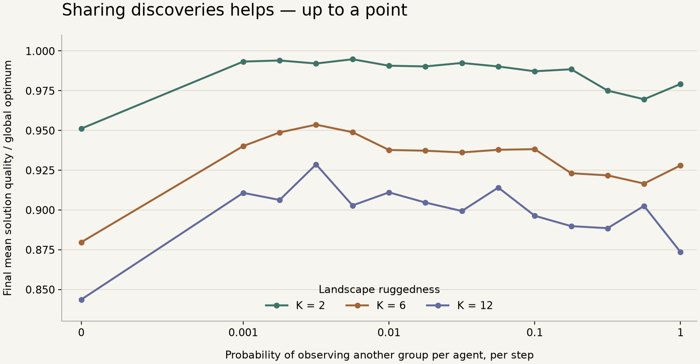

# Collective search: when communication helps

A simulation toolkit for studying how groups balance **sharing discoveries** with **independent exploration**.

Agents search problems with many local optima. Each agent can copy a better solution from a neighbour or try to improve its own. Changing who can communicate, and how often, changes both how quickly good solutions spread and how much independent search survives.

The repository includes the simulator, recorded runs, figures, mathematical models, and experiments with predictions fixed before collecting data.

## What the experiments found

The original hypothesis—that performance peaks at the diversity transition—was **refuted in an exploratory study**. Later experiments found a broad range of intermediate communication rates that outperformed both isolated groups and maximum cross-group sharing. Predicting the precise location of that range remains unresolved.



**Recorded island-search experiment:** 100 agents in 10 groups, 500 steps, four landscapes and six seeds per setting, with one local search trial per step. Agents communicate within their group at every setting; the horizontal axis controls observation of other groups. Higher `K` means a more rugged landscape. Curves show means; the broad peaks do not identify a precise optimal rate.

| Landscape ruggedness | No cross-group sharing | Maximum cross-group sharing | Best sampled intermediate rate |
| --- | ---: | ---: | ---: |
| K = 2 | 0.9512 | 0.9792 | **0.9948** |
| K = 6 | 0.8797 | 0.9280 | **0.9536** |
| K = 12 | 0.8436 | 0.8735 | **0.9286** |

Values are final population-mean fitness divided by the landscape's global optimum. The intermediate column selects the best tested rate on these data; it is not a held-out performance estimate. [Study report](results/study2/summary.md) · [Saved runs](results/study2/runs.npy) · [Figure script](scripts/plot_overview.py)

## Study record

| Question | Recorded outcome | Evidence |
| --- | --- | --- |
| Does peak performance coincide with the diversity transition? | **Refuted, exploratory.** Criteria were written after seeing the data. | [Study](studies/optimum-at-transition/study.yaml), [results](results/figures/summary.md) |
| Does the balance between information spread and local search predict the optimum? | **Inconclusive.** The intermediate-performance prediction passed; the location and scaling tests were unresolved. | [Study](studies/spread-vs-search/study.yaml), [results](results/study2/summary.md) |
| Can task duration predict the distance from a propagation transition? | **Refuted.** A critical population prediction failed, despite passing reservoir predictions. | [Study](studies/task-set-gap/study.yaml), [results](results/study_gap/summary.md) |
| Do revised coverage and timing predictions generalize across population sizes? | **Inconclusive.** Timing passed in 8/8 settings; critical ratio tests remained unresolved. | [Study](studies/task-set-gap-2/study.yaml), [results](results/study_gap2/summary.md) |
| Does a more robust plateau estimator resolve those tests? | **Frozen; no outcomes recorded.** A reanalysis of previously seen data motivated this version, but is not its test. | [Plan](studies/task-set-gap-3/study.yaml), [design notes](studies/task-set-gap-3/notes.md) |

The broader idea that one law explains the best distance from criticality across these systems remains a research hypothesis. The model experiments do not establish an optimal communication policy for real language-model agents.

## How the model works

1. **Create a search problem.** An NK landscape assigns a score to each binary solution. The global optimum is computed exhaustively, so solution quality has a known reference.
2. **Connect the agents.** Use a random graph or groups with dense internal connections and a configurable rate of cross-group observation.
3. **Copy or search.** An agent that sees a better neighbour copies it; otherwise it tries local bit flips. Optional copying noise and additional local trials are separate controls.
4. **Measure the population.** Record solution quality, diversity, convergence, copying, fitness evaluations, contacts, and propagation of discoveries.

Copying and local search compete for steps, so equal run lengths need not mean equal numbers of fitness evaluations. The simulator records both. Ancestry labels describe surviving lineages; they are not a count of independent searches.

Related modules study [branching processes](critpop/branching.py) and [reservoir memory](critpop/reservoir.py). Small [Gemma relay](results/gemma_relay.md) and [distributed-clue](results/clue_network_pilot.md) pilots document experimental-design limitations; they are separate from the population-search results above.

## Run locally

Python 3.11+ and [uv](https://docs.astral.sh/uv/) are required. The core simulator uses NumPy and Matplotlib; no GPU or model download is needed.

```bash
git clone https://github.com/Larkooo/collective-criticality.git
cd collective-criticality
uv sync --frozen

# Reproduce the bundled 80-run regression fixture exactly.
uv run python scripts/regression.py

# Rebuild the overview figure from recorded study data.
uv run python scripts/plot_overview.py

# Check the mathematical examples and model-scope assumptions.
uv run python scripts/formal_checks.py --model-checks
```

For a fresh small sweep and its plots:

```bash
mkdir -p /tmp/collective-search
uv run python -m critpop sweep --quick --out /tmp/collective-search/sweep.npz
uv run python -m critpop analyze /tmp/collective-search/sweep.npz \
  --figdir /tmp/collective-search/figures
```

Full experiment entry points are `scripts/study2.py`, `scripts/study_gap.py`, and `scripts/study_gap2.py`. These can take minutes to tens of minutes and write result files. Reproduce an archived study in a separate checkout at its recorded freeze revision. In particular, the current `study_gap2.py` also contains version-three settings: running its reanalysis against version-two arrays asks for a noise setting absent from those data and does not reproduce the archived report exactly.

## Research method

Studies use [sever](https://github.com/Larkooo/sever) to record competing explanations, numeric pass/fail criteria, analysis plans, and stopping rules before data collection. Frozen sections are hashed to a Git commit. Failed and inconclusive predictions remain in the record; a revised design gets a new study version.

```bash
uv run sever status
uv run sever check task-set-gap-3
```

The first study was exploratory and was never frozen. Numerical checks of mathematical examples test the implementation; they are distinct from experimental evidence for a hypothesis.

## Explore the repository

| Path | Contents |
| --- | --- |
| [critpop/](critpop/) | Population simulator, landscapes, branching processes, reservoir model |
| [scripts/](scripts/) | Experiments, analysis, regression checks, figure generation |
| [studies/](studies/) | Predictions, freeze records, outcomes, and computed verdicts |
| [results/](results/) | Saved arrays, plots, and experiment reports |
| [Formal structure](docs/FORMAL_STRUCTURE.md) | Mathematical models and their stated assumptions |
| [Review guide](docs/REVIEWING.md) | How to inspect predictions, reproduce results, and challenge a claim |

The search dynamics build on Lazer and Friedman (2007). Earlier theory drafts and research plans are retained in `docs/`; use the study record above for the current experimental status.
